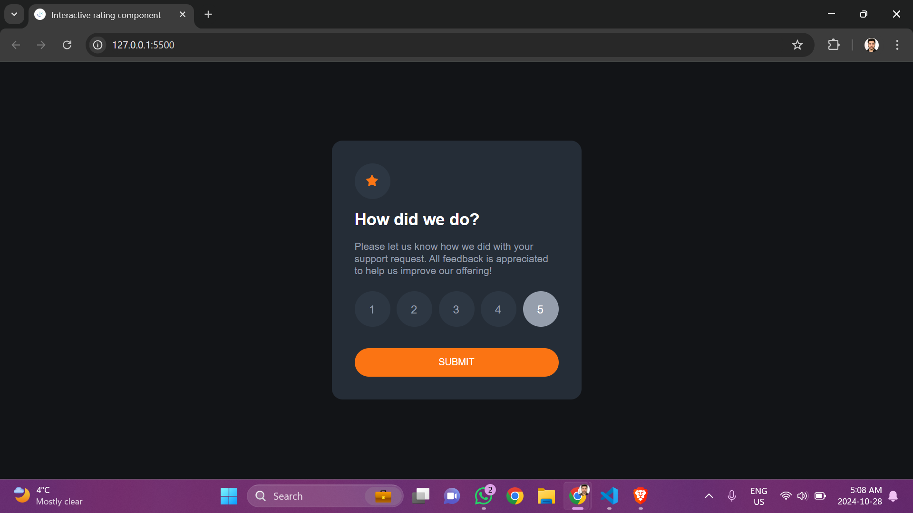
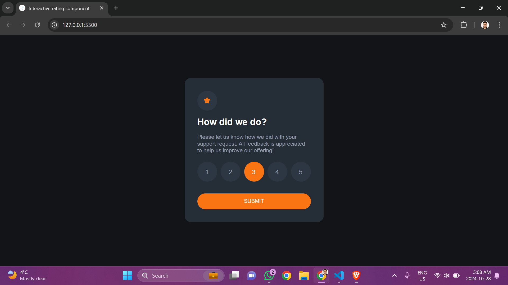
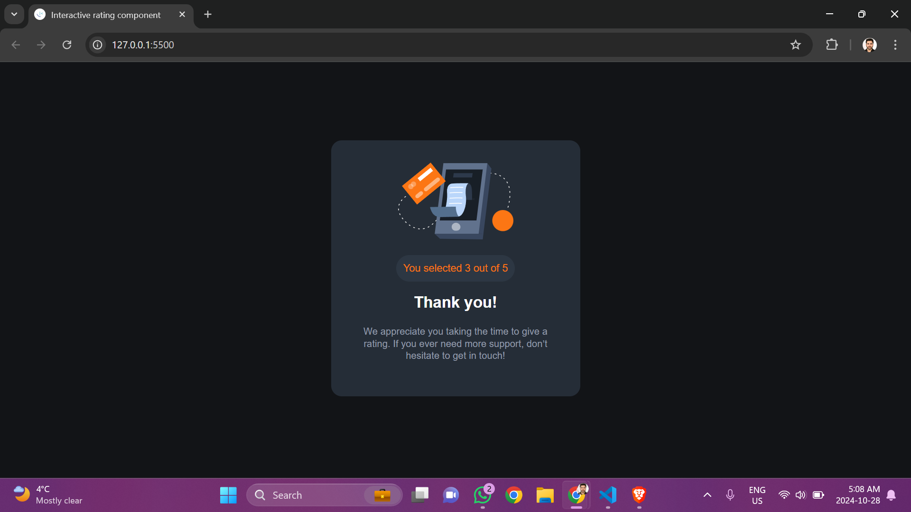
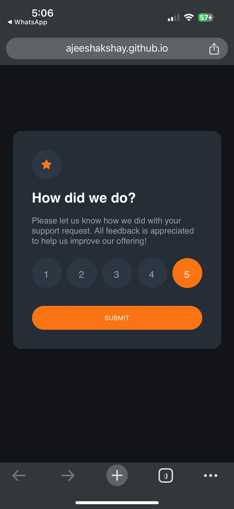

# Frontend Mentor - Interactive rating component solution

This is a solution to the [Interactive rating component challenge on Frontend Mentor](https://www.frontendmentor.io/challenges/interactive-rating-component-koxpeBUmI). Frontend Mentor challenges help you improve your coding skills by building realistic projects. 

## Table of contents

- [Overview](#overview)
  - [The challenge](#the-challenge)
  - [Screenshot](#screenshot)
  - [Links](#links)
- [My process](#my-process)
  - [Built with](#built-with)
  - [What I learned](#what-i-learned)
  - [Continued development](#continued-development)
- [Author](#author)
- [Acknowledgments](#acknowledgments)


## Overview

### Screenshot


The above is the desktop version


The above is the desktop version


The above is the desktop version


The above is the mobile version

### Links

- Solution URL: [https://www.frontendmentor.io/solutions/interactive-rating-card-with-js-KVD_aypVY3]
- Live Site URL: [https://ajeeshakshay.github.io/ineractive-rating-component/]

## My process

### Built with

- Semantic HTML5 markup
- CSS custom properties
- Javascript
- media queries

### What I learned

I still need to get the hang of Javascript. There is a lot of concepts I need to understand. Selecting from a group of elements and identifying which we have selected is something whic I have to learn. I have taken a lot of reference for this project. I also had got stuck at shifting from 1 container to another when the ratings are submitted

```
submit_btn.addEventListener("click", function(){
  if (rate) {
    rate_point.innerText = rate;
    rating_section.classList.add("hidden");
    thank_section.classList.remove("hidden");
  }
});
```

### Continued development

I have to learn more on DOM and Listners and do more mini project untill I start the next one on my own.


## Author

- Github - [https://github.com/ajeeshakshay]
- Frontend Mentor - [https://www.frontendmentor.io/profile/ajeeshakshay]

## Acknowledgments

- [Youtube](https://www.youtube.com/watch?v=Nw4y8cAU70w&t=809s) 

